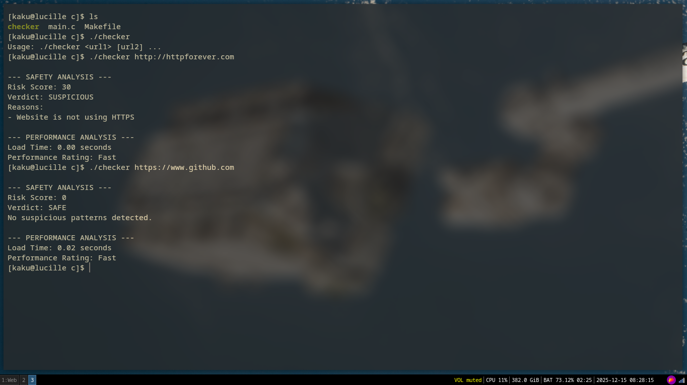
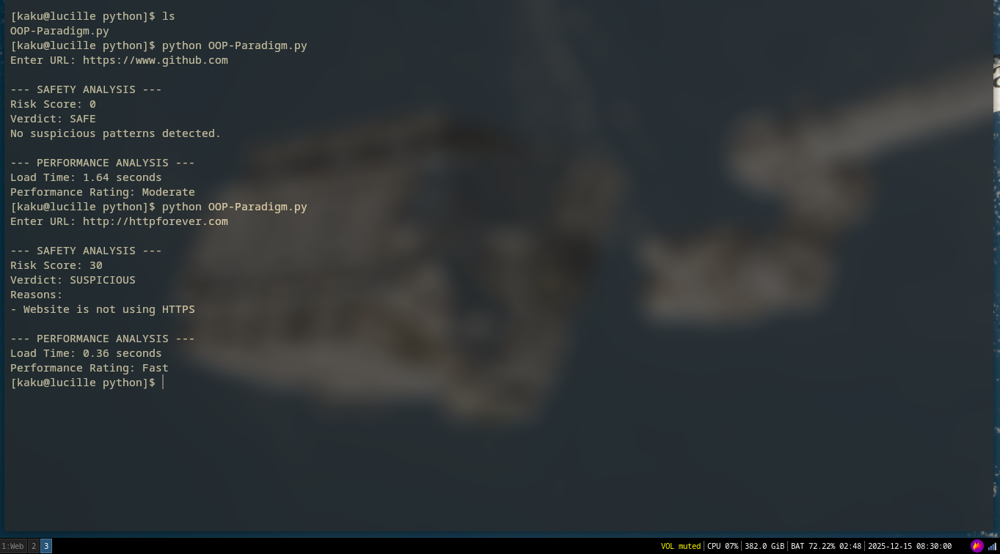
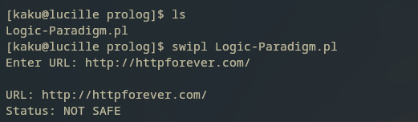
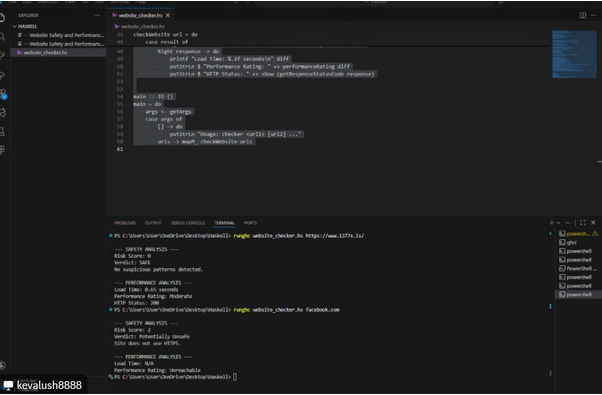

# webex
> web extension for scanning websites safety

A Website Safety and Performance Checker

# The Machine Problem
<ol type="A">
<li>The Problem Statement</li>
    
This project creates a simple program that checks whether a website is safe to visit and demonstrates how the same problem can be solved using different programming paradigms.

    
 
<li>Solutions</li>
    <ol>
        <li>Imperative Paradigm Solution 
            <a href="https://github.com/Eii-nn/webexPPL/blob/5cfe241b260e66dcbbd2c6fa77f783a6b3297419/c/main.c">
          C file
        </a>
        </li>
        <li>Object-Oriented Paradigm Solution 
            <a href="https://github.com/Eii-nn/webexPPL/blob/5cfe241b260e66dcbbd2c6fa77f783a6b3297419/python/OOP-Paradigm.py">
          Python file
        </a>
        </li>
        <li>Logic Paradigm Solution</li>
         <a href="https://github.com/Eii-nn/webexPPL/blob/b99781407ad49251925e3859ae43d62e812e194a/prolog/Logic-Paradigm.pl">
          Prolog file
        </a>
        <li>Functional Paradigm Solution</li>
         <a href="https://github.com/Eii-nn/webexPPL/blob/b99781407ad49251925e3859ae43d62e812e194a/haskell/website_checker.hs">
          Haskell file
        </a>
    </ol>
</ol>

# Language Definition
<ol type="A">
<li>Syntax</li>
    a. BNF from basic syntax until control structures 
Basic Syntax
<pre>
&lt;program&gt; ::= &lt;statement&gt; | &lt;statement&gt; &lt;program&gt;
&lt;statement&gt; ::= &lt;assignment&gt; | &lt;conditional&gt; | &lt;loop&gt;
</pre>
      Control Structures
<pre>
&lt;conditional&gt; ::= if &lt;condition&gt; then &lt;statement&gt;
&lt;loop&gt; ::= while &lt;condition&gt; do &lt;statement&gt;
</pre>
      Data Types
<pre>
&lt;datatype&gt; ::= int | float | string | boolean
</pre>
          Subprograms / Functions
<pre>
&lt;function&gt; ::= function &lt;name&gt; ( &lt;parameters&gt; ) &lt;body&gt;
</pre>
    
  
<li>Semantics</li>
    a. Informal Semantics
        <ol>
        <li>Basic Syntax</li>
            
Variables store information for the URLs, the risk score from the criteria and results.
			Statements tell our program what action to perform.

        <li>Control Structures</li>
            
Conditional statements decide whether the url is safe or not.
Loops allow the program to run through all necessary safety checks for the url without repeating code.

        <li>Data Types</li>
            
Strings stores the URLs and messages (reasons mostly)
				Integers store risk scores
				Floating-point number store loading time (Performance check)

        <li>Subprograms</li>
            
Functions and methods divide the program into smaller tasks.
Each subprogram performs a specific job in the program (checking https, counting symbols/chars)

        </ol>
    </ol>

# Evaluation of the programming languages

For our Imperative we have used C language, it was fast and we have full control over our memory it was also efficient. The problem we have encountered is that it is not beginner-friendly, so we had to study while we wrote the code.

	
For our OOP we used Python language, we find it the easiest to use out of all the four programming languages we have used for this problem. It is easy to read and more beginner-friendly.

	
For the Logic, we used Prolog language and we encountered some difficulty in understanding the whole concept in less than 3 weeks. That's why we have cut short the implementation and removed the performance checker for this part of the solution.
 
	
For the Functional, we used Haskell. As for the installation of the environment, this is by far the longest time it took to just be able to write the program. Our team is also unfamiliar with the syntax but it was easy to test.

# Concluding Statements

This project shows that the same problem can be solved using different programming paradigms.
Each paradigm has its own strengths and weaknesses, but all were able to analyze website safety successfully. As for the performance check, one paradigm was unsuccessful. 
Understanding different paradigms helps programmers choose the best approach for different problems.

# Bibliographic Sources

# Appendices
<ol type="A">
<li>Screenshots</li>
    <ol>
        <li>Imperative Paradigm</li>
        
        <li>Object-Oriented Paradigm </li>
        
        <li>Logic Paradigm </li>
        
        <li>Functional Paradigm </li>
        
    </ol>
<li>Photo documentation</li>
    
</ol>
